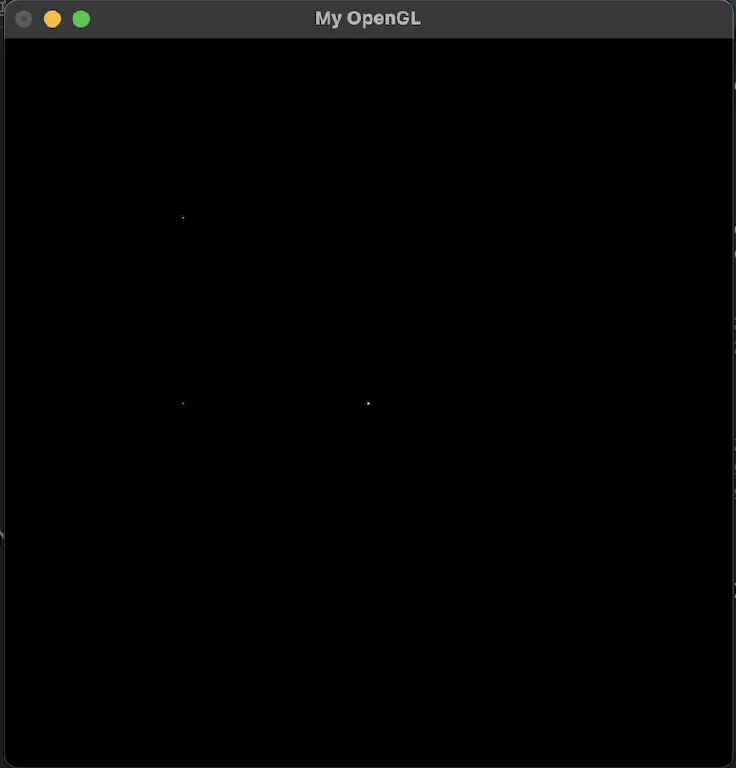

# Algoritmos de Rasterização

---

## Índice

-   [Introdução](#Introdução)
-   [Implementação do Algoritmo de Bresenham](#Implementação-do-Algoritmo-de-Bresenham)
-   [Gerando Triângulos](Gerando-Triângulos)

---

### Introdução

#### Trabalho da disciplina **Introdução ao Processamento de Imagens** ministrada pelo professor **Maelson** da UNIPE

Para a compilação do projeto em MacOS, o programa requer as seguintes flags:

```bash
g++ main.cpp -o meu_programa -I. -framework OpenGL -framework GLUT
```

Para a compilação do projeto em Windows, é necessário o uso da seguinte linha de comando:

```bash
g++ main.cpp -o meu_programa -I"path/to/GLUT/include" -L"path/to/GLUT/lib" -lglut32 -lopengl32 -lglu32
```

> "`path/to/GLUT/include`" deve ser o caminho onde estão localizados os cabeçalhos (headers) do GLUT no Windows.  
> "`path/to/GLUT/lib`" deve ser o caminho onde estão localizadas as bibliotecas do GLUT.

Inicialmente, o projeto continha um arquivo Makefile, mas este foi removido para evitar problemas ao construir o projeto usando uma IDE e também ao tentar compilar em sistemas Windows e MacOS através da linha de comando.

---

### Implementação dos Pixels

Para a implementação de um algoritmo capaz de modificar os pixels na memória da aplicação, a documentação presente nos slides do professor foi crucial para entender os conceitos e facilitar a implementação. A maior dificuldade encontrada foi compreender como funcionavam as dimensões da aplicação para poder modificar os pixels desejados.

Ao modificar os 4 bytes por pixel, chegamos ao seguinte algoritmo para a edição de um pixel específico:

```c++
void PutPixel(int x, int y, int r, int g, int b) {
    if (x < 0 || x >= IMAGE_WIDTH || y < 0 || y >= IMAGE_HEIGHT) {
        return;
    }

    int index = (x + y * IMAGE_WIDTH) * 4;
    FBptr[index] = r;
    FBptr[index + 1] = g;
    FBptr[index + 2] = b;
    FBptr[index + 3] = 255;
}
```

Após a criação dessa função, a tarefa de modificar os pixels de acordo com as dimensões da imagem tornou-se mais fácil. Isso ocorreu porque foi possível entender que basta modificar os 4 bytes correspondentes ao pixel para editá-lo na posição desejada.

O resultado observado foi:

<p align="center">
    <br>
    
    <h5 align="center">Figura 1 - Função putPixel()</h5>
    <br>
</p>

### Implementação do Algoritmo de Bresenham

---

A implementação do Algoritmo de Bresenham para a função `DrawLine` foi um processo bastante desafiador, e o entendimento a partir apenas da documentação fornecida pelo professor mostrou-se insuficiente. Foi necessário um período de tentativa e erro, além de diversas pesquisas, para obter um entendimento mais claro dos conceitos e algoritmos envolvidos nesta etapa.

Após um período de busca e estudo, dois recursos foram particularmente úteis:

-   **O primeiro link foi crucial para superar essa fase:**
    -   [Bresenham Line Algorithm: A Powerful Tool for Efficient Line Drawing](https://saturncloud.io/blog/bresenham-line-algorithm-a-powerful-tool-for-efficient-line-drawing/)
    -   [INE 5420 - Computação Gráfica - Aula 11.1. Rasterização](https://www.youtube.com/watch?v=huw7fJcSwQY&ab_channel=AldovonWangenheim)

#### Código do Algoritmo

O algoritmo resultante foi o seguinte:

```c++
void DrawLine(int x1, int y1, int x2, int y2, int r, int g, int b){
    int dx = abs(x2 - x1);
    int dy = abs(y2 - y1);
    bool slope = dy > dx;

    if (slope) {
        std::swap(x1, y1);
        std::swap(x2, y2);
    }

    if (x1 > x2) {
        std::swap(x1, x2);
        std::swap(y1, y2);
    }

    dx = std::abs(x2 - x1);
    dy = std::abs(y2 - y1);
    int error = dx / 2;
    int y = y1;
    int ystep = (y1 < y2) ? 1 : -1;

    for (int x = x1; x <= x2; ++x) {
        if (slope) {
            PutPixel(y, x, r, g, b);
        } else {
            PutPixel(x, y, r, g, b);
        }
        error -= dy;
        if (error < 0) {
            y += ystep;
            error += dx;
        }
    }
}
```

#### Resultados

Com a implementação do algoritmo acima, agora é possível desenhar linhas no canvas. A Figura 1 abaixo ilustra este resultado.

<p align="center">
    <br>
    
    <h5 align="center">Figura 1 - Função DrawLine()</h5>
    <br>
</p>

#### Código para Geração da Visualização

A função usada para gerar a visualização, de acordo com a imagem acima, é a seguinte:

```c++
void MyGlDraw(void) {
    int middleX = (int)(IMAGE_WIDTH / 2); // 256
    int middleY = (int)(IMAGE_WIDTH / 2); // 256

    DrawLine( middleX, middleY, 0, 0, 0, 255, 0); // topo esquerdo
    DrawLine( middleX, middleY, 512, 0, 0, 0, 255); // topo direito
    DrawLine( middleX, middleY, 512, 512, 255, 0, 0); // baixo direito
    DrawLine( middleX, middleY, 0, 512, 255, 255, 255); // baixo esquerdo

    DrawLine( middleX, middleY, 0, 256, 255, 255, 0); // centro esquerdo
    DrawLine( middleX, middleY, 512, 256, 255, 0, 255); // centro direito
    DrawLine( middleX, middleY, 256, 0, 128, 0, 128); // centro topo
    DrawLine( middleX, middleY, 256, 512, 128, 0, 128); // centro baixo

}
```

Com isso, conclui-se a implementação bem-sucedida do Algoritmo de Bresenham para a rasterização de linhas.

### Gerando Triângulos

Após as dificuldades encontradas para criar a função _DrawLine()_, a criação de triangulos acabou ficando mais fácil

#### Algoritmo usando para criação de triângulos

```c++
void DrawTriangle(int x1, int y1, int x2, int y2, int x3, int y3, int r, int g, int b) {
    DrawLine(x1, y1, x2, y2, r, g, b);
    DrawLine(x2, y2, x3, y3, r, g, b);
    DrawLine(x3, y3, x1, y1, r, g, b);
}
```

#### Resultado gerado

<p align="center">
    <br>
    
    <h5 align="center">Figura 1 - Função DrawLine()</h5>
    <br>
</p>
